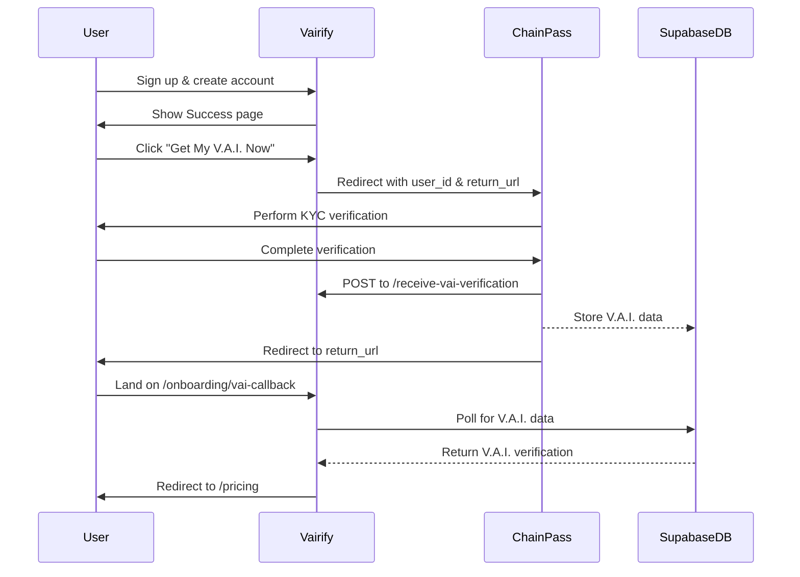

# ChainPass + Vairify Integration Testing Guide

## Overview
This guide explains how to test the integration between ChainPass (identity verification) and Vairify.

## Integration Flow



## Testing the Integration

### 1. Test the Redirect to ChainPass

**Steps:**
1. Sign up for a new account in Vairify
2. Complete email verification (if enabled)
3. On the Success page, click "Get My V.A.I. Now"
4. Verify that you're redirected to ChainPass with:
   - `user_id` parameter (your Supabase user UUID)
   - `return_url` parameter (points to Vairify callback URL)
   - `coupon` parameter (if you used a referral code)

**Expected URL format:**
```
https://chainpass.id/?user_id=<UUID>&return_url=https://vairify.io/onboarding/vai-callback
```

### 2. Test the Edge Function (Simulated)

Since ChainPass needs to call your edge function, you can test it manually:

**Endpoint:**
```
POST https://gotcpbqwilvigxficruc.supabase.co/functions/v1/receive-vai-verification
```

**Sample Request:**
```bash
curl -X POST \
  'https://gotcpbqwilvigxficruc.supabase.co/functions/v1/receive-vai-verification' \
  -H 'Content-Type: application/json' \
  -H 'Authorization: Bearer YOUR_ANON_KEY' \
  -d '{
    "user_id": "YOUR_USER_UUID",
    "vai_number": "VAI-12345678",
    "biometric_photo_url": "https://example.com/photo.jpg",
    "le_disclosure_accepted": true,
    "signature_agreement_accepted": true,
    "complycube_transaction_number": "CC-TEST-12345"
  }'
```

**Expected Response:**
```json
{
  "success": true,
  "message": "V.A.I. verification received and stored successfully",
  "vai_number": "VAI-12345678"
}
```

### 3. Test Duplicate Detection

**Steps:**
1. Call the edge function with the same `complycube_transaction_number` twice
2. Second call should return a 409 error

**Expected Response (2nd call):**
```json
{
  "error": "Duplicate verification attempt detected",
  "message": "This identity has already been verified with a different VAI number",
  "existing_vai_number": "VAI-12345678"
}
```

### 4. Test the Callback Page

**Steps:**
1. After ChainPass verification, user should be redirected to:
   ```
   https://vairify.io/onboarding/vai-callback
   ```
2. The page will poll for V.A.I. data (up to 30 seconds)
3. Once found, shows success message and redirects to /pricing

**Manual Test:**
1. Create a V.A.I. verification record in the database (or call the edge function)
2. Navigate to `/onboarding/vai-callback`
3. Should show "Verification complete!" and auto-redirect

### 5. Test Login with V.A.I.

**Steps:**
1. Go to the login page
2. Select "V.A.I." authentication method
3. Enter your V.A.I. number (e.g., VAI-12345678)
4. Choose "Face Recognition" or "Password"
5. Complete authentication

## Database Verification

Check the `vai_verifications` table:

```sql
SELECT * FROM vai_verifications;
```

**Expected columns:**
- `id` (UUID)
- `user_id` (UUID - matches Supabase auth.users)
- `vai_number` (string)
- `biometric_photo_url` (string)
- `complycube_transaction_number` (string)
- `le_disclosure_accepted` (boolean)
- `signature_agreement_accepted` (boolean)
- `created_at` (timestamp)

## Edge Function Logs

View logs for debugging:

```bash
# In Lovable Cloud UI
Cloud > Edge Functions > receive-vai-verification > Logs
```

**What to look for:**
- "Received VAI verification data from ChainPass"
- "Checking for duplicate transaction number..."
- "V.A.I. verification stored successfully"
- Any error messages

## Common Issues

### 1. User not redirected back to Vairify
**Solution:** Check that ChainPass has the correct `return_url` parameter

### 2. Verification data not found
**Solution:** 
- Check edge function logs
- Verify the edge function was called successfully
- Check database for the record

### 3. Duplicate V.A.I. error
**Solution:** This is expected behavior - each ComplyCube transaction should only create one V.A.I.

## Environment URLs

### Development (devtest)
- Vairify: `https://devtest.vairify.io`
- ChainPass: `https://devtest.chainpass.id`

### Production
- Vairify: `https://vairify.io`
- ChainPass: `https://chainpass.id`

## Integration Checklist

- [x] Success page redirects to ChainPass with user_id and return_url
- [x] Edge function receives and validates V.A.I. data
- [x] Duplicate detection prevents multiple V.A.I.s per identity
- [x] V.A.I. data is stored in database
- [x] Callback page polls for verification data
- [x] User is redirected to pricing after verification
- [x] Login supports V.A.I. authentication
- [x] Environment-aware URLs (devtest vs production)

## Next Steps

1. **Coordinate with ChainPass team** to provide them with:
   - Edge function endpoint URL
   - Expected request/response format
   - Test user credentials

2. **End-to-End Testing:**
   - Complete a real verification flow with ChainPass
   - Monitor logs and database
   - Verify user experience

3. **Error Handling:**
   - Test timeout scenarios
   - Test network failures
   - Test invalid data handling
